# A题

**题目:**

如果一个整数数组 $a_1,a_2,\cdots,a_n$ 满足以下条件，那么这个数组就是美丽的整数 $k$ ：

- 所有 $j$ 上的 $a_{j}$ 之和，其中 $j$ 是 $k$ 的倍数， $1 \le j \le n$ 是 $k$ 的倍数。本身是 $k$ 的倍数。
- 更正式地说，如果 $\sum_{k | j} a_{j}$ 能被所有 $1 \le j \le n$ 的 $k$ 整除，那么数组 $a$ 在 $k$ 的限制下是美丽的。这里，符号 ${k|j}$ 表示 $k$ 除以 $j$ ，即 $j$ 是 $k$ 的倍数。

给定 $n$ ，求一个正非零整数数组，其中每个元素都小于或等于 $10^5$ ，且所有 $1 \le k \le n$ 都是美丽的。

可以证明答案总是存在的。

**输入**

每个测试包含多个测试用例。第一行包含测试用例的数量 $t$ ( $1 \le t \le 100$ )。测试用例说明如下。

每个测试用例的第一行也是唯一一行包含一个整数 $n$ ( $1 \le n \le 100$ ) - 数组的大小。

**样例**
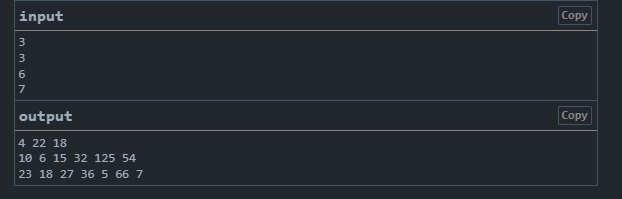

**题解**
所以ak的值必须可以被下标为 k 的因数整除，那么可以很容易想到 k 的倍数符合，所以数组的每个值只要是 下标的倍数就可

*代码*
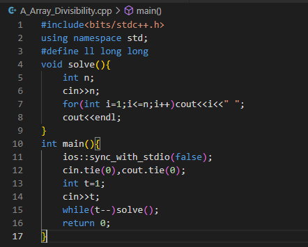


# B题

给你两个由数字 $a$ 和 $b$ 组成的网格，网格中有 $n$ 行和 $m$ 列。网格中的所有数值都是 $0$ 、 $1$ 或 $2$ 。

您可以多次对 $a$ 执行以下操作：

- 选取网格中任意一个长宽为 $\ge 2$ 的子矩形。您可以选择整个网格作为子矩形。
- 子矩形有四个角。取所选子矩形中任意一对斜对角，并将它们的值加上 $1$ 并进行模 $3$ 。
- 对于未选中的一对角，在它们的值上加上 $2$ 并进行模 $3$ 。

需要注意的是，此操作只改变被选中的子矩形的角的值。

是否可以通过任意次数(可能为零)的上述操作将网格 $a$ 转换为网格 $b$ ？

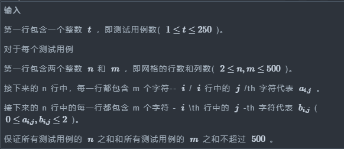

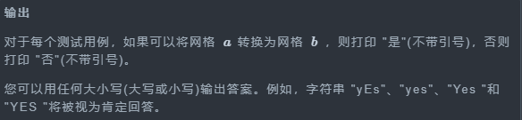

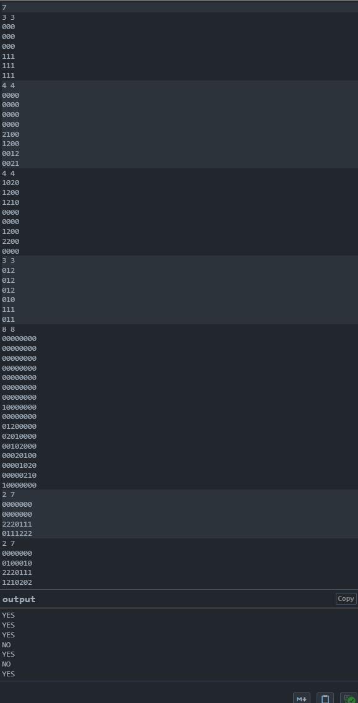

*题解*（数学，构造，模拟）


要我们判断是否相同，则可以把 a 和 b 两个矩阵转化为等价矩阵进行比较
如我们可以从二节矩阵分析：

$\begin{matrix}0 & 0 \\ 0 & 0\end{matrix}$
  转为 $\begin{matrix}1 & 2 \\ 2 & 1\end{matrix}$ ， $\begin{matrix}2 & 1 \\ 1 & 2\end{matrix}$  这两个矩阵，则这三个矩阵相互等价

又如：

$\begin{matrix}0 & 1 \\ 0 & 0\end{matrix}$
  转为 $\begin{matrix}1 & 0 \\ 2 & 1\end{matrix}$ ， $\begin{matrix}2 & 2 \\ 1 & 2\end{matrix}$  这两个矩阵，则这三个矩阵相互等价
 
我们可以利用此法判断矩阵矩阵是否相同：
可以以矩阵中左上角元素为根据进行相应变化，使之变为0.然后判断矩阵。
从样例中可以看出当前方法可由二阶矩阵扩展成高阶矩阵，从而判断矩阵是否相同.

```cpp
#include<bits/stdc++.h>
using namespace std;
#define ll long long
int a[550][550],b[550][550];
void solve(){
    int n,m;
    char x;
    cin>>n>>m;
    for(int i=1;i<=n;i++){
        for(int j=1;j<=m;j++){
            cin>>x;
            a[i][j]=x-'0';
        }
    }
    for(int i=1;i<=n;i++){
        for(int j=1;j<=m;j++){
            cin>>x;
            b[i][j]=x-'0';
        }
    }
    for(int i=1;i<=n-1;i++){
        for(int j=1;j<=m-1;j++){
            if(a[i][j]==1){
                a[i][j]=0;
                a[i][j+1]=(a[i][j+1]+1)%3;
                a[i+1][j]=(a[i+1][j]+1)%3;
                a[i+1][j+1]=(a[i+1][j+1]+2)%3;
            }
            else if(a[i][j]==2){
                a[i][j]=0;
                a[i][j+1]=(a[i][j+1]+2)%3;
                a[i+1][j]=(a[i+1][j]+2)%3;
                a[i+1][j+1]=(a[i+1][j+1]+1)%3;
            }
        }
    }
    for(int i=1;i<=n-1;i++){
        for(int j=1;j<=m-1;j++){
            if(b[i][j]==1){
                b[i][j]=0;
                b[i][j+1]=(b[i][j+1]+1)%3;
                b[i+1][j]=(b[i+1][j]+1)%3;
                b[i+1][j+1]=(b[i+1][j+1]+2)%3;
            }
            else if(b[i][j]==2){
                b[i][j]=0;
                b[i][j+1]=(b[i][j+1]+2)%3;
                b[i+1][j]=(b[i+1][j]+2)%3;
                b[i+1][j+1]=(b[i+1][j+1]+1)%3;
            }
        }
    }
    for(int i=1;i<=n;i++){
        for(int j=1;j<=m;j++){
            if(a[i][j]!=b[i][j]){
                cout<<"NO\n";
                return ;
            }
        }
    }
    cout<<"YES\n";
}
int main(){
    ios::sync_with_stdio(false);
    cin.tie(0),cout.tie(0);
    int t;
    cin>>t;
    while(t--)solve();
    return 0;
}
```

# C题

**题目**（贪心，暴力，二分）


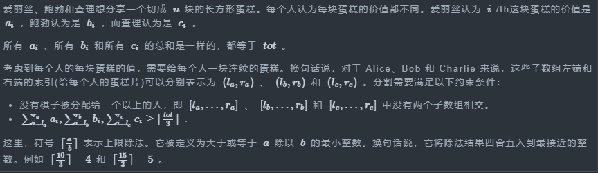

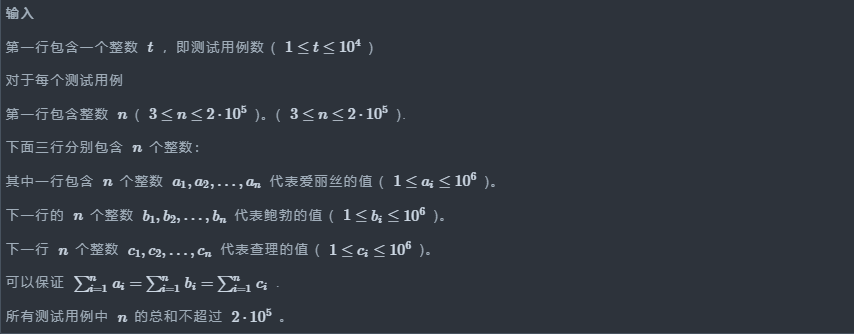


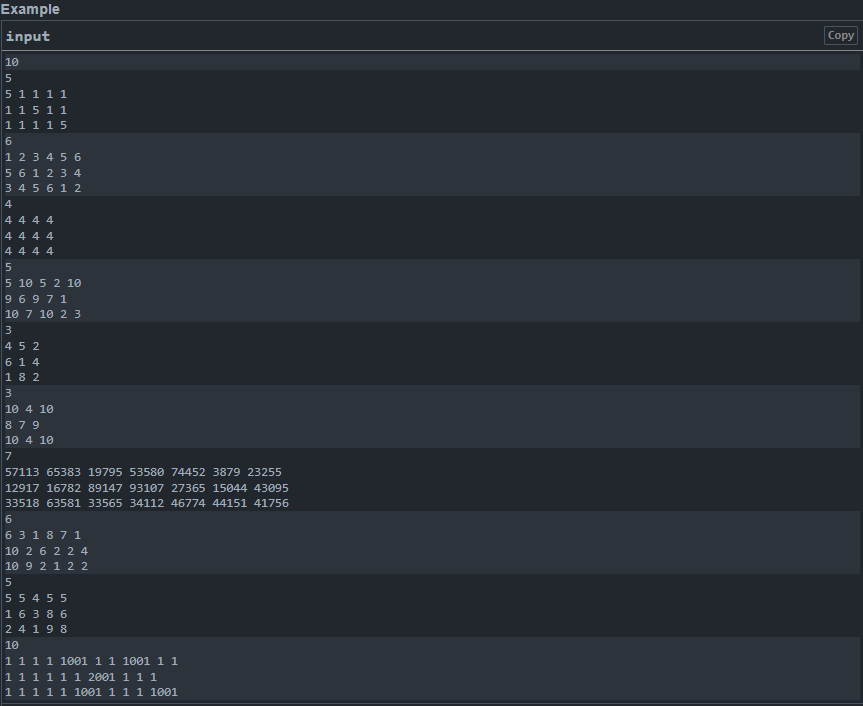

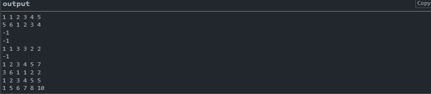

思路：

因要从三个数组中找出三个不相交的区间，且三个区间覆盖n的长度。

所以问题就转为：要找到两个边界，使按照这两个边界把三个数组切分成三堆。

第一个要找的区间必定是从 1 开始寻找，假设找到最先满足的位置为 i ，则第二个数组就从 i+1 位置开始寻找，找到第三个满足的位置为 j ，第三个区间就为 j+1 --n.
并对三个区间判断是否是取自三个数组，并且区间和大于 totalsum/3(注意这里为向上取整)。(跟双指针问题类似)(贪心)

则区间为（1，i）,(i+1,j),(j+1,n)。

又因为数据范围为$2 \cdot 10^5$，所以不能用双重for循环去暴力解决。我们可用二分快速查找到满足的数据，然后进行判断是否满足条件。


```cpp
#include<bits/stdc++.h>
using namespace std;
#define ll long long
ll a[3][1000010];
ll n,sum=0;
bool check(int k0,int k1,int k2){
    int L1,L2;
    vector<pair<int,int>>ans(3);
    L1=lower_bound(a[k0]+1,a[k0]+n+1,sum)-a[k0];
    L2=lower_bound(a[k1]+L1,a[k1]+n+1,sum+a[k1][L1])-a[k1];
    if(L2!=n+1&&a[k2][n]-a[k2][L2]>=sum){
        ans[k0].first=1;
        ans[k0].second=L1;
        ans[k1].first=L1+1;
        ans[k1].second=L2;
        ans[k2].first=L2+1;
        ans[k2].second=n;
        for(int i=0;i<3;i++){
            cout<<ans[i].first<<" "<<ans[i].second<<" ";
        }
        cout<<endl;
        return 1;
    }
    return 0;
}
void solve(){
    cin>>n;
    int k0=0,k1=1,k2=2;
    for(int i=1;i<=n;i++){
        cin>>a[k0][i];
        a[k0][i]+=a[k0][i-1];
    }
    sum=a[k0][n];
    if(sum%3)sum+=3-a[k0][n]%3;
    for(int i=1;i<=n;i++){
        cin>>a[k1][i];
        a[k1][i]+=a[k1][i-1];
    }
    for(int i=1;i<=n;i++){
        cin>>a[k2][i];
        a[k2][i]+=a[k2][i-1];
    }
    sum/=3;
    if(check(0,1,2))return;
    else if(check(0,2,1))return;
    else if(check(1,2,0))return;
    else if(check(1,0,2))return;
    else if(check(2,0,1))return;
    else if(check(2,1,0))return;
    cout<<-1<<endl;
}
int main(){
    ios::sync_with_stdio(false);
    cin.tie(0),cout.tie(0);
    int t;
    cin>>t;
    while(t--)solve();
    return 0;
}
```

# D题(树状数组，构造)

**题目**

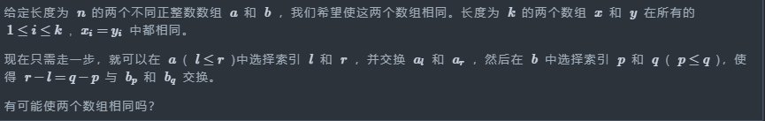

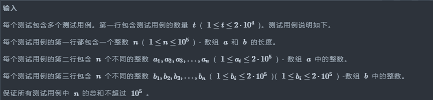


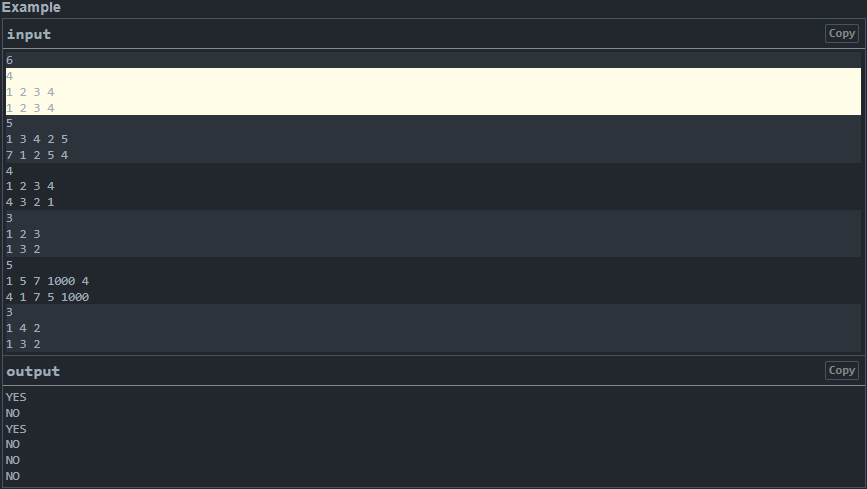

思路：

两个a,b 数组要交换两个间隔相同的元素，两个数组在变化的情况较复杂，便于思考，我们可以用在一个数组进行两次交换间隔相同的元素来平替。
则应变化偶次的情况下有解。如：1，3，2 到1，2，3数组就一定只变化了一次，一定为不可能。

变化又可以相互叠加：如1，2，3，4，5到3，2，5，4，1数组的变化，既可以当作进行了（1 ，3），（3 ，5）的两次等距离变化，也可以当作（1，5）的单次变化。因此引出新的问题，题目中变化的本质核心是什么。我们可以通过对小数组的小距离变化考虑来体会关键。

这时我们会想到变化的最小距离是k=2的变化，也就是相邻元素进行交换。那我们进一步思考大距离交换和小距离交换有无联系。从上述的交换叠加的样例可以看出，可以用小距离去替换大距离。

从数组 1，3到数组 1，3中，我们可以认为进行了0，2，4，...,2n次交换，所以我们只需找出最少的交换次数即是真实交换次数。

则问题进一步转换成由数组 a 变化成数组 b ,进行了最少多少次距离为2的交换。
（从这里开始思路错误，把次数错当成距离的和，从而开始计算距离和的奇偶）
该问题联想到，a数组变换到数组b,应从元素角度考虑：元素由在数组 a 的位置到数组 b 的位置的下标变化。而变化是一步一步交换的。可联想到逆序对问题。

则该问题转换为数组 a 到数组 b 中的逆序对的次数是奇数还是偶数

数据范围为$10^5$，所以统计逆序数应用树状数组（单点修改+单点查询）或者分治法统计。


```cpp
#include<bits/stdc++.h>
using namespace std;
#define ll long long
#define lowbit(x) ((x)&(-x))
const int N=2e5+10;
vector<int>tree(2*N);
void update(int x,int d){
    while(x<N){
        tree[x]+=d;
        x+=lowbit(x);
    }
}
int sum(int x){
    int res=0;
    while(x){
        res+=tree[x];
        x-=lowbit(x);
    }
    return res;
}
void solve(){
    ll n,x,k=0,k0=0,ans=0;
    vector<int>a(N),vis(N);
    cin>>n;
    for(int i=0;i<n*2;i++)tree[i]=0;
    for(int i=1;i<=n;i++){
        cin>>x;
        vis[x]=i;
    }
    for(int i=1;i<=n;i++){
        cin>>a[i];
        if(vis[a[i]])k0++;
    }
    if(k0!=n){
        cout<<"NO\n";
        return;
    }
    for(int i=n;i>0;i--){
        update(vis[a[i]],1);
        ans+=sum(vis[a[i]]-1);
    }
    if(ans%2){
        cout<<"NO\n";
        return;
    }
    cout<<"YES\n";
}
int main(){
    ios::sync_with_stdio(false);
    cin.tie(0),cout.tie(0);
    int t=1;
    cin>>t;
    while(t--)solve();
    return 0;
}
```