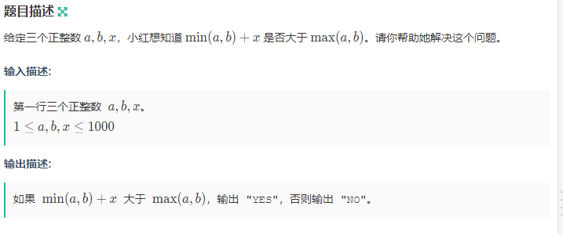
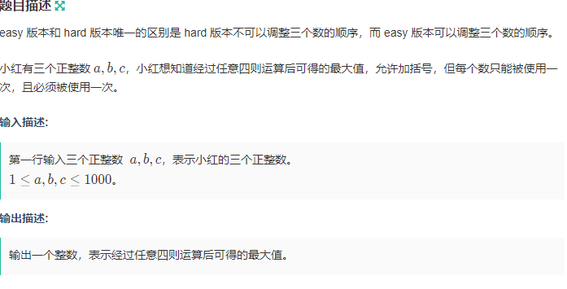
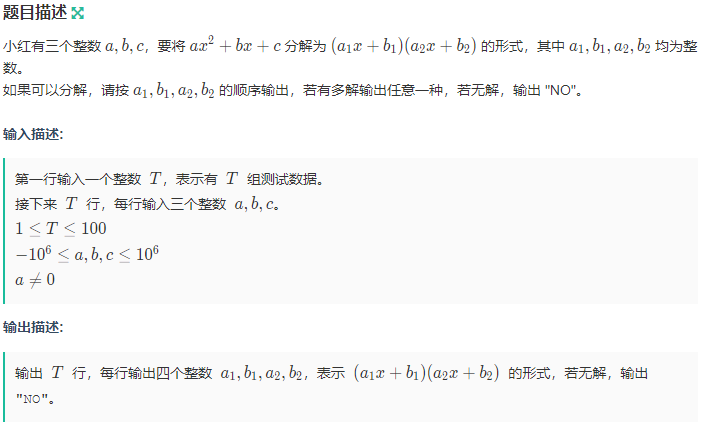

**A题**<br>
<br>
题型:签到题<br>
思路:判断即可。
```cpp
#include<bits/stdc++.h>
using namespace std;
int main()
{
    int a,b,x;
    cin>>a>>b>>x;
    if(min(a,b)+x>max(a,b))
    cout<<"YES";
    else
    cout<<"NO";
    return 0;
}
```
**B题**<br>
<br>
题型:签到题<br>
思路:首先用sort排序这三个数,要使运算最大,则遇到 1 就加,其它的就乘即可。<br>
```cpp
#include<bits/stdc++.h>
using namespace std;
int main()
{
    int a[3];
    for(int i=0;i<3;i++)
    cin>>a[i];
    cout<<max(max(a[0]+a[1]+a[2],(a[2]+a[1])*a[0]),max((a[0]+a[1])*a[2],a[0]*a[1]*a[2]));
    return 0;
}
```
**C题**<br>
<br>
题型:签到题<br>
思路:与 B 题像似,不过不能排序,多判断 1 在后面的情况即可。<br>
```cpp
#include<bits/stdc++.h>
using namespace std;
int main()
{
    int a[3];
    for(int i=0;i<3;i++)
    cin>>a[i];
    cout<<max(max(a[0]+a[1]+a[2],(a[2]+a[1])*a[0]),max((a[0]+a[1])*a[2],a[0]*a[1]*a[2]));
    return 0;
}
```
**D题**<br>
<br>
题型:数学题<br>
思路:首先将方程转化成等于零的形式,根据一元二次方程的根等于(-b+-sqrtl(b*b-4*a*c))/2*a<br>
题目要求化为两括号相乘的形式,即 x1=-b1/a1,x2=-b2/a2,要使答案为整数 即一元二次方程的根能化成最简分式<br>
则sqrtl(b*b-4*a*c)必须是整数才能满足条件,因为一个数的开根一定是无限不循环小数,不能转化成最简分式
<br>
因为一个最简分式的平方不可能是整数,最简分式的分子和分母最大公约数是 1 ,平方之后必然不能化简<br>
综上所述 当sqrtl(b*b-4*a*c)是整数则将一元二次方程的根化成最简分式之后,再把 x1,x2代入
求得 a1 b1 a2 b2。<br>
最后判断 a 与 a1*a2 的倍数关系,相乘即可,<br>
```cpp
#include <bits/stdc++.h>
using namespace std;
typedef long long ll;
int main()
{
    int t;
    cin>>t;
    while(t--)
    {
        ll a,b,c;
        scanf("%lld%lld%lld",&a,&b,&c);
        ll det=b*b-4*a*c;
        if(det<0){cout<<"NO\n"; continue;}
        ll te=sqrtl(det);
        if(te*te!=det){cout<<"NO\n";continue;}
        ll a1=2*a,b1=b-te,a2=2*a,b2=b+te;
        ll gcd1=__gcd(abs(a1),abs(b1));
        ll gcd2=__gcd(abs(a2),abs(b2));
        a1/=gcd1;b1/=gcd1;a2/=gcd2;b2/=gcd2;
        ll z=a/a1/a2;
        a1*=z;b1*=z;
        cout<<a1<<" "<<b1<<" "<<a2<<" "<<b2<<"\n";
    }
    return 0;
}
```